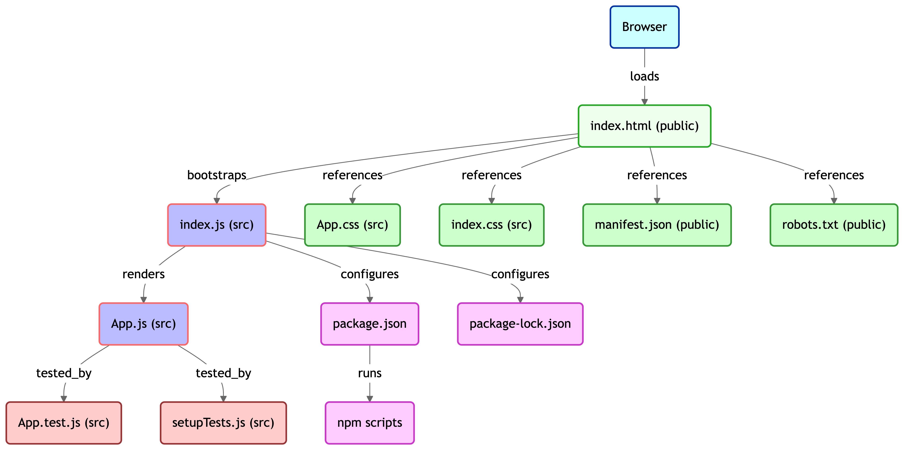

# 🧑‍🏫 KANBAS – FULL STACK WEB APPLICATION

**Kanbas** is a full-stack course management system modeled after Canvas. It includes a fully interactive **React frontend** and a lightweight **Node.js backend API**, using a file-based JSON database. The project is ideal for learning full-stack development, routing, REST APIs, and state management.

---

## 🔗 REPOSITORIES

- 🔹 **Frontend (React)**: [kanbas-react-web-app](https://github.com/akshat151/kanbas-react-web-app)
- 🔹 **Backend (Node.js)**: [kanbas-node-server-app](https://github.com/akshat151/kanbas-node-server-app)

---

## 🧩 FEATURES

- ✅ Dynamic UI built with React components
- ✅ Modular routing and data-driven views
- ✅ Node.js backend with express routes
- ✅ File-based JSON database (no external DB needed)
- ✅ Local environment support via `.env`
- ✅ Clean project separation between frontend and backend

---

## 🗺️ ARCHITECTURE DIAGRAM

---

## 📁 PROJECT STRUCTURE

### 🔷 Frontend Repo: [`kanbas-react-web-app`](https://github.com/akshat151/kanbas-react-web-app)

#### 🔹 Client Layer

- **Browser**

#### 🔹 Static HTML Layer

- [index.html (public)](https://github.com/akshat151/kanbas-react-web-app/blob/main/public/index.html)

#### 🔹 React Bootstrapping Layer

- [index.js (src)](https://github.com/akshat151/kanbas-react-web-app/blob/main/src/index.js)

#### 🔹 React Application Layer

- [App.js (src)](https://github.com/akshat151/kanbas-react-web-app/blob/main/src/App.js)

#### 🔹 Static Assets

- [App.css](https://github.com/akshat151/kanbas-react-web-app/blob/main/src/App.css)  
- [index.css](https://github.com/akshat151/kanbas-react-web-app/blob/main/src/index.css)  
- [manifest.json](https://github.com/akshat151/kanbas-react-web-app/blob/main/public/manifest.json)  
- [robots.txt](https://github.com/akshat151/kanbas-react-web-app/blob/main/public/robots.txt)

#### 🔹 Testing & Build Setup

- [App.test.js](https://github.com/akshat151/kanbas-react-web-app/blob/main/src/App.test.js)  
- [setupTests.js](https://github.com/akshat151/kanbas-react-web-app/blob/main/src/setupTests.js)  
- [package.json](https://github.com/akshat151/kanbas-react-web-app/blob/main/package.json)  
- [package-lock.json](https://github.com/akshat151/kanbas-react-web-app/blob/main/package-lock.json)

---

### 🔷 Backend Repo: [`kanbas-node-server-app`](https://github.com/akshat151/kanbas-node-server-app)

#### 🔹 App Entry & Config

- [app.js](https://github.com/akshat151/kanbas-node-server-app/blob/main/app.js)  
- [.env](https://github.com/akshat151/kanbas-node-server-app/blob/main/.env)

#### 🔹 API Routes

- [Assignments Routes](https://github.com/akshat151/kanbas-node-server-app/blob/main/assignments/routes.js)  
- [Courses Routes](https://github.com/akshat151/kanbas-node-server-app/blob/main/courses/routes.js)  
- [Modules Routes](https://github.com/akshat151/kanbas-node-server-app/blob/main/modules/routes.js)

#### 🔹 Data Layer

- [File-based JSON DB](https://github.com/akshat151/kanbas-node-server-app/blob/main/Database/index.js)

---

## 🧭 GETTING STARTED

### 🛠️ REQUIREMENTS

- Node.js 18+
- npm
- React (bundled in frontend)
- Any browser

---

### 🔧 LOCAL SETUP

1. **Clone Both Repos**

2. Backend Setup (Node.js)

   cd kanbas-node-server-app
   npm install
   npm start

   Server will run on http://localhost:4000 by default.

3. Frontend Setup (React)

   cd ../kanbas-react-web-app
   npm install
   npm start

   Frontend runs on http://localhost:3000 and calls backend via REST.

---

📦 OPTIONAL SETUP
	•	Add a .env file in kanbas-node-server-app:

✅ TESTING

Frontend

Run tests with:

npm test

Uses App.test.js and setupTests.js.

Backend

Currently tested manually via frontend + REST calls. You can easily add routes and expand modularity.

---

📚 LICENSE

This project is licensed under the MIT License. See the LICENSE file for more details.

---

🙌 CREDITS

Built by Akshat to explore scalable full-stack development using React and Node.js.

---
Need help with:
	•	🧪 Backend test setup
	•	🔒 CORS / Auth middleware
	•	🚀 Deployment to Render / Vercel
Let me know!
